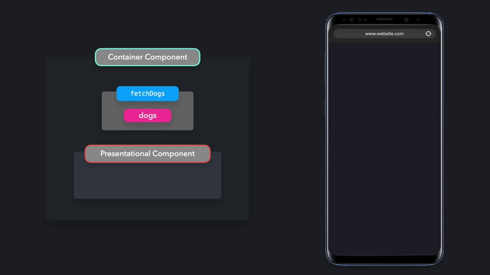
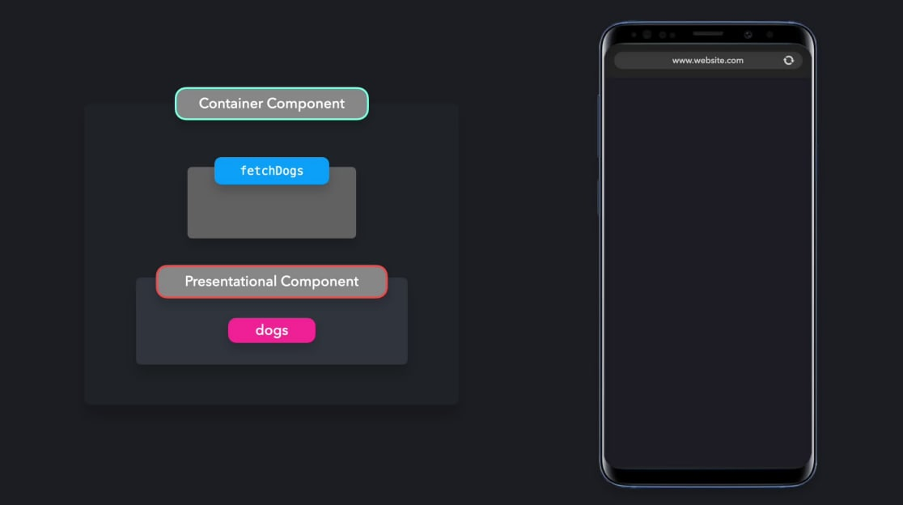
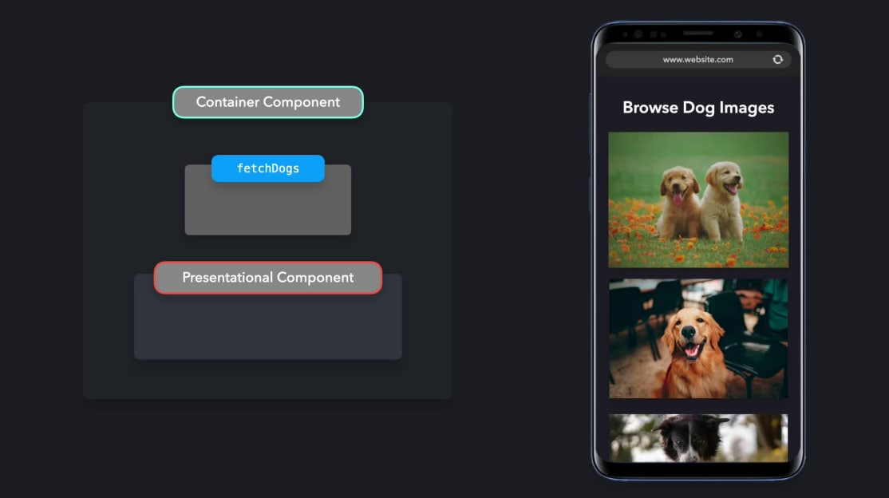
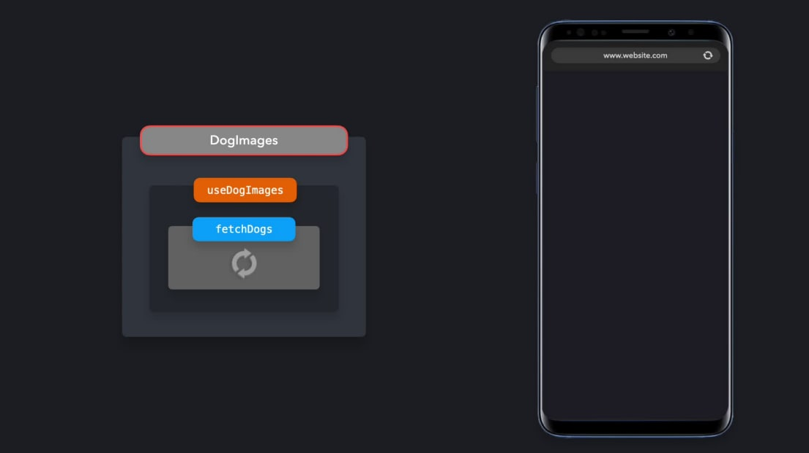
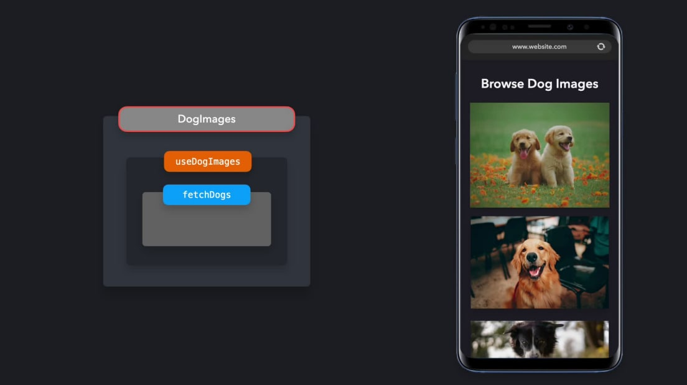

b# **_Container/Presentational Pattern_**

> Enforce <b>separation</b> of concerns by separating the <b>view</b> from the <b>application logic</b>

In React, one way to enforce separation of concerns is by using
the Container/Presentational pattern. With this pattern, we can separate the
view from the application logic.

Let's say we want to create an application that fetches 6 dog images, and
renders these images on the screen. Ideally, we want to enforce separation of
concerns by separating this process into two parts:

1. <b>Presentational Components</b>: Components that care about how data is shown to the user. In this example, that's the rendering the list of dog
   images.
2. <b>Container Components</b>: Components that care about what data is shown
   to the user. In this example, that's fetching the dog images.

<center>
    
    
    
</center>

<hr>

## Presentational Component

A presentational component receives its data through props. Its primary
function is to simply display the data it receives the way we want them to,
including styles, without modifying that data.

Let's take a look at the example that displays the dog images. When rendering
the dog images, we simply want to map over each dog image that was
fetched from the API, and render those images. In order to do so, we can
create a functional component that receives the data through props, and
renders the data it received.

```jsx
import React from "react";

export default function DogImages({ dogs }) {
  return dogs.map((dog, i) => );
}
```

The `DogImages` component is a presentational component. Presentational
components are usually stateless: they do not contain their own React state,
unless they need a state for UI purposes. The data they receive, is not altered
by the presentational components themselves.

Presentational components receive their data from container components.

<hr>

## Container Component

The primary function of container components is to pass data to
presentational components, which they contain. Container components
themselves usually don't render any other components besides the
presentational components that care about their data. Since they don't render
anything themselves, they usually do not contain any styling either.

In our example, we want to pass dog images to
the `DogImages` presentational component. Before being able to do so, we
need to fetch the images from an external API. We need to create a container
component that fetches this data, and passes this data to the presentational
component `DogImages` in order to display it on the screen.

```jsx
import React from "React";
import DogImages from "./DogImages";

export default class DogImagesContainer extends React.Component {
  constructor() {
    super();
    this.state = {
      dogs: [],
    };
  }

  componentDidMount() {
    fetch("https://dog.ceo/api/breed/labrador/images/random/6")
      .then((res) => res.json())
      .then(({ message }) => this.setState({ dogs: message }));
  }

  render() {
    return <DogImages dogs={this.state.dogs}>
  }
}
```

Combining these two components together makes it possible to separate
handling application logic with the view.

<hr>

## Hooks

In many cases, the Container/Presentational pattern can be replaced with
React Hooks. The introduction of Hooks made it easy for developers to add
statefulness without needing a container component to provide that state.

Instead of having the data fetching logic in
the `DogImagesContainer` component, we can create a custom hook that
fetches the images, and returns the array of dogs.

```js
export default function useDogImages() {
  const [dogs, setDogs] = useState([]);

  useEffect(() => {
    fetch("https://dog.ceo/api/breed/labrador/images/random/6")
      .then((res) => res.json())
      .then(({ message }) => setDogs(message));
  }, []);

  return dogs;
}
```

By using this hook, we no longer need the
wrapping `DogImagesContainer` container component to fetch the data, and
send this to the presentational `DogImages` component. Instead, we can use
this hook directly in our presentational `DogImages` component!

```jsx
import React from "react";

export default function DogImages() {
  const dogs = useDogImages();

  return dogs.map((dog, i) => );
}
```

By using the `useDogImages` hook, we still separated the application logic
from the view. We're simply using the returned data from
the `useDogImages` hook, without modifying that data within
the `DogImages` component.

<center>
    
    
</center>

Hooks make it easy to separate logic and view in a component, just like the
Container/Presentational pattern. It saves us the extra layer that was
necessary in order to wrap the presentational component within the container
component.

<hr>

## Benefits

The Container/Presentational pattern encourages the separation of concerns.
Presentational components can be pure functions which are responsible for
the UI, whereas container components are responsible for the state and data
of the application. This makes it easy to enforce the separation of concerns.

Presentational components are easily made reusable, as they
simply display data without altering this data. We can reuse the presentational
components throughout our application for different purposes.

Since presentational components don't alter the application logic, the
appearance of presentational components can easily be altered by someone
without knowledge of the codebase, for example a designer. If the
presentational component was reused in many parts of the application, the
change can be consistent throughout the app.

Testing presentational components is easy, as they are usually pure functions.
We know what the components will render based on which data we pass,
without having to mock a data store.

## Disadvantages 

Although we can still use the Container/Presentational pattern, even with
React Hooks, this pattern can easily be an overkill in smaller sized application.
