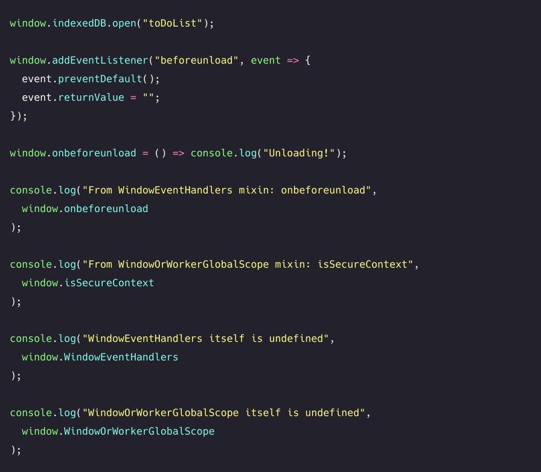

# **_Mixin Pattern_**

> Add functionality to objects or classes without inheritance

A mixin is an object that we can use in order to add reusable functionality to
another object or class, without using inheritance. We can't use mixins on their
own: their sole purpose is to add functionality to objects or classes without
inheritance.

Let's say that for our application, we need to create multiple dogs. However,
the basic dog that we create doesn't have any properties but a name property.

```js
class Dog {
  constructor(name) {
    this.name = name;
  }
}
```

A dog should be able to do more than just have a name. It should be able to
bark, wag its tail, and play! Instead of adding this directly to the Dog, we can
create a mixin that provides the `bark`, `wagTail` and `play` property for us.

```js
const dogFunctionality = {
  bark: () => console.log("Woof!"),
  wagTail: () => console.log("Wagging my tail!"),
  play: () => console.log("Playing!"),
};
```

We can add the `dogFunctionality` mixin to the `Dog` prototype with
the Object.assign method. This method lets us add properties to the target
object: `Dog.prototype` in this case. Each new instance of Dog will have
access to the the properties of `dogFunctionality`, as they're added to
the `Dog`'s prototype!

```js
class Dog {
  constructor(name) {
    this.name = name;
  }
}

const dogFunctionality = {
  bark: () => console.log("Woof!"),
  wagTail: () => console.log("Wagging my tail!"),
  play: () => console.log("Playing!"),
};

Object.assign(Dog.prototype, dogFunctionality);
```

Let's create our first pet, `pet1`, called Daisy. As we just added
the `dogFunctionality` mixin to the `Dog`'s prototype, Daisy should be able
to walk, wag her tail, and play!

```js
const pet1 = new Dog("Daisy");

pet1.name; // Daisy
pet1.bark(); // Woof!
pet1.play(); // Playing!
```

Perfect! Mixins make it easy for us to add custom functionality to classes or
objects without using inheritance.

Although we can add functionality with mixins without inheritance, mixins
themselves can use inheritance!

Most mammals (besides dolphins.. and maybe some more) can walk and
sleep as well. A dog is a mammal, and should be able to walk and sleep!
Let's create a `animalFunctionality` mixin that adds
the `walk` and `sleep` properties.

```js
const animalFunctionality = {
  walk: () => console.log("Walking!"),
  sleep: () => console.log("Sleeping!"),
};
```

We can add these properties to the `dogFunctionality` prototype,
using `Object.assign`. In this case, the target object
is `dogFunctionality`.

```js
const animalFunctionality = {
  walk: () => console.log("Walking!"),
  sleep: () => console.log("Sleeping!"),
};

const dogFunctionality = {
  bark: () => console.log("Woof!"),
  wagTail: () => console.log("Wagging my tail!"),
  play: () => console.log("Playing!"),
  walk() {
    super.walk();
  },
  sleep() {
    super.sleep();
  },
};

Object.assign(dogFunctionality, animalFunctionality);
Object.assign(Dog.prototype, dogFunctionality);
```

Perfect! Any new instance of Dog can now access the walk and
sleep methods as well.

```js
class Dog {
  constructor(name) {
    this.name = name;
  }
}

const animalFunctionality = {
  walk: () => console.log("Walking!"),
  sleep: () => console.log("Sleeping!"),
};

const dogFunctionality = {
  __proto__: animalFunctionality /**/,
  bark: () => console.log("Woof!"),
  wagTail: () => console.log("Wagging my tail!"),
  play: () => console.log("Playing!"),
  walk() {
    super.walk();
  },
  sleep() {
    super.sleep();
  },
};

Object.assign(Dog.prototype, dogFunctionality);

const pet1 = new Dog("Daisy");

console.log(pet1.name); // Daisy
pet1.bark(); // Woof!
pet1.play(); // Playing!
pet1.walk(); // Walking!
pet1.sleep(); // Sleeping!
```

An example of a mixin in the real world is visible on the Window interface in a
browser environment. The `Window` object implements many of its properties
from the `WindowOrWorkerGlobalScope` and `WindowEventHandlers`
mixins, which allow us to have access to properties such as `setTimeout`
and `setInterval`, `indexedDB`, and `isSecureContext`.

Since it's a mixin, thus is only used to add functionality to objects, you won't
be able to create objects of type `WindowOrWorkerGlobalScope`.

<center>
    
</center>

## <b>React (pre ES6)</b>

Mixins were often used to add functionality to React components before the
introduction of ES6 classes. The React team discourages the use of mixins as
it easily adds unnecessary complexity to a component, making it hard to
maintain and reuse. The React team encouraged the use of higher order
components instead, which can now often be replaced by Hooks.

Mixins allow us to easily add functionality to objects without inheritance by
injecting functionality into an object's prototype. Modifying an object's
prototype is seen as bad practice, as it can lead to prototype pollution and a
level of uncertainty regarding the origin of our functions.
