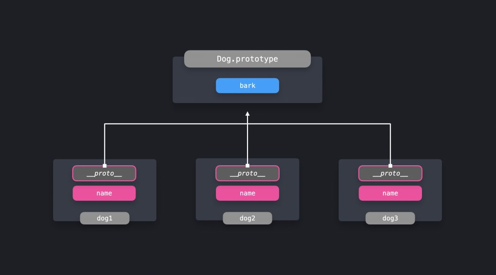
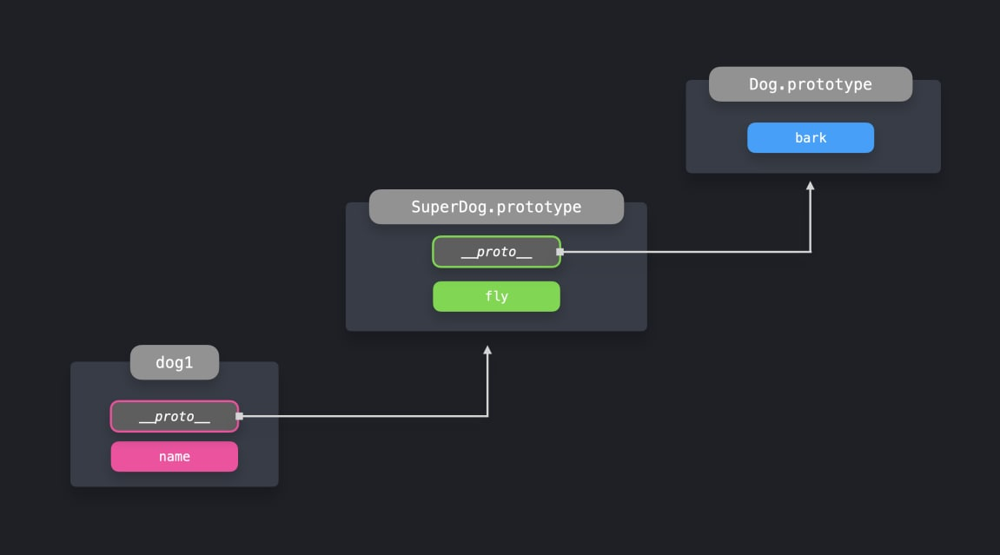

# **_Prototype Pattern_**

> Share properties among many objects of the same type

The prototype pattern is a useful way to share properties among many objects
of the same type. The prototype is an object that's native to JavaScript, and
can be accessed by objects through the prototype chain.

In our applications, we often have to create many objects of the same type. A
useful way of doing this is by creating multiple instances of an ES6 class.

Let's say we want to create many dogs! In our example, dogs can't do that
much: they simply have a name, and they can bark!

```js
class Dog {
  private name: string;
  constructor(name: string) {
    this.name = name;
  }

  bark(): string {
    return "Woof!";
  }
}

const dog1 = new Dog("Daisy");
const dog2 = new Dog("Max");
const dog3 = new Dog("Spot");
```

Notice here how the constructor contains a name property, and the class itself
contains a bark property. When using ES6 classes, all properties that are
defined on the class itself, bark in this case, are automatically added to
the prototype.
We can see the prototype directly through accessing the prototype property
on a constructor, or through the `__proto__` property on any instance.

```js
console.log(Dog.prototype);
// constructor: ƒ Dog(name, breed) bark: ƒ bark()

console.log(dog1.__proto__);
// constructor: ƒ Dog(name, breed) bark: ƒ bark()
```

The value of `__proto__` on any instance of the constructor, is a direct
reference to the constructor's prototype! Whenever we try to access a
property on an object that doesn't exist on the object directly, JavaScript
will go down the prototype chain to see if the property is available within the
prototype chain.

<center>
    
</center>

The prototype pattern is very powerful when working with objects that should
have access to the same properties. Instead of creating a duplicate of the
property each time, we can simply add the property to the prototype, since all
instances have access to the prototype object.

Since all instances have access to the prototype, it's easy to add properties to
the prototype even after creating the instances.

Say that our dogs shouldn't only be able to bark, but they should also be able
to play! We can make this possible by adding a play property to the prototype.

```js
class Dog {
  constructor(name) {
    this.name = name;
  }
  bark() {
    return "Woof!";
  }
}
const dog1 = new Dog("Daisy");
const dog2 = new Dog("Max");
const dog3 = new Dog("Spot");

Dog.prototype.play = () => {
  console.log("Playing now...");
};

dog1.play(); // Playing now...
```

The term <b>prototype chain</b> indicates that there could be more than one step.
Indeed! So far, we've only seen how we can access properties that are directly
available on the first object that `__proto__` has a reference to. However,
prototypes themselves also have a `__proto__` object!
Let's create another type of dog, a super dog! This dog should inherit
everything from a normal `Dog`, but it should also be able to fly. We can create
a `SuperDog` by extending the `Dog` class and adding a `fly` method.

```ts
class SuperDog extends Dog {
  constructor(name) {
    super(name);
  }

  fly() {
    return "Flying!";
  }
}

const sd1 = new SuperDog("Daisy");

sd1.bark();
sd1.fly();
sd1.play();
```

We have access to the bark method, as we extended the Dog class. The
value of `__proto__` on the prototype of `SuperDog` points to
the `Dog.prototype` object!
It gets clear why it's called a prototype chain: when we try to access a
property that's not directly available on the object, JavaScript recursively
walks down all the objects that `__proto__` points to, until it finds the
property!

<center>
    
</center>

<hr>

## Object.create

The `Object.create` method lets us create a new object, to which we can
explicitly pass the value of its prototype.

```js
const dog = {
  bark() {
    return "Woof!";
  },
};

const pet1 = Object.create(dog);
```

Although `pet1` itself doesn't have any properties, it does have access to
properties on its prototype chain! Since we passed the `dog` object as `pet1`’s
prototype, we can access the bark property.

```js
pet1.bark(); // Woof!
console.log("Direct properties on pet1:", Object.keys(pet1));
console.log("Properties on pet1's prototype:", Object.keys(pet1.__proto__));
```

Perfect! `Object.create` is a simple way to let objects directly inherit
properties from other objects, by specifying the newly created object's
prototype. The new object can access the new properties by walking down the
prototype chain.

The prototype pattern allows us to easily let objects access and inherit
properties from other objects. Since the prototype chain allows us to access
properties that aren't directly defined on the object itself, we can avoid
duplication of methods and properties, thus reducing the amount of memory
used.
