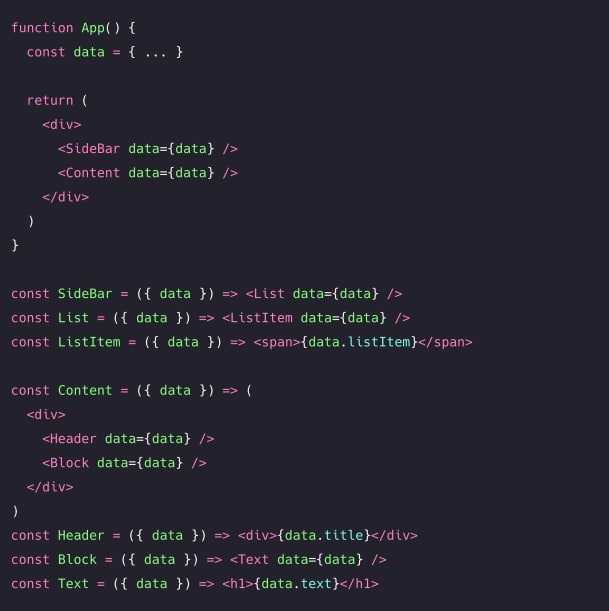
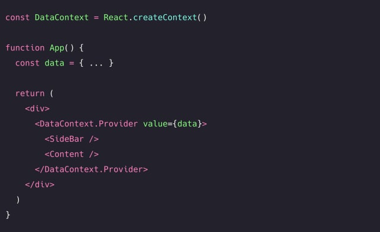
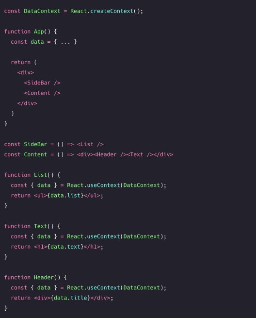
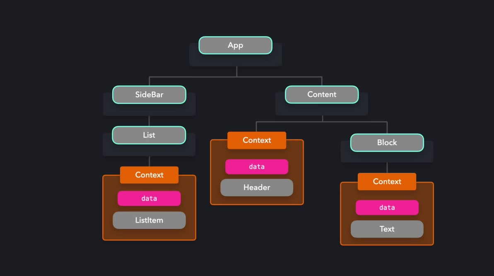
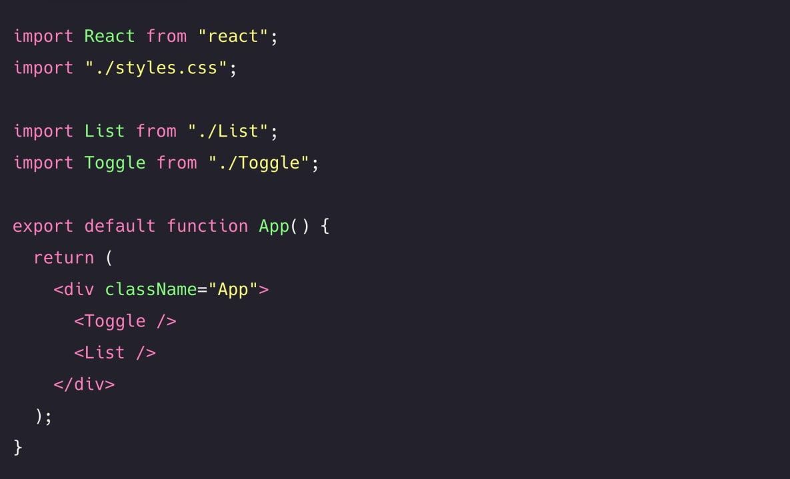
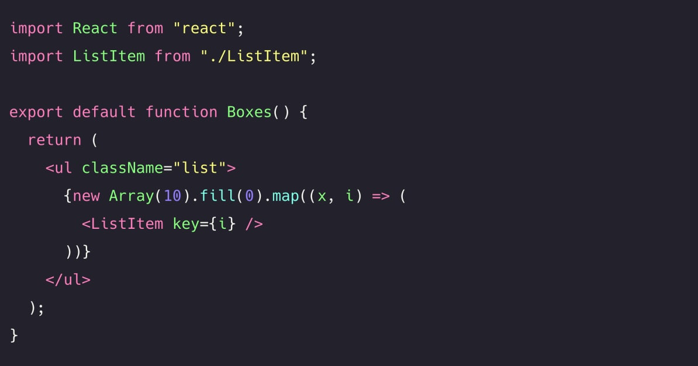
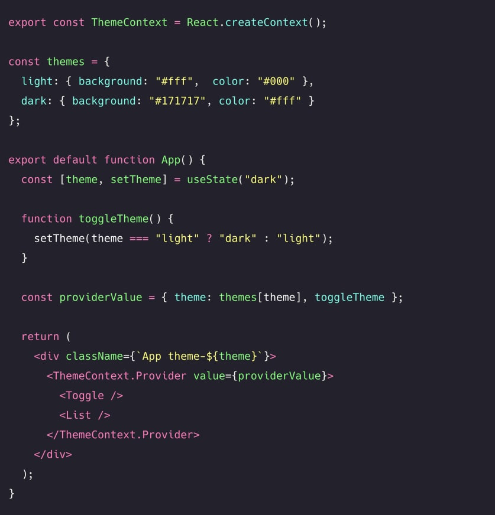
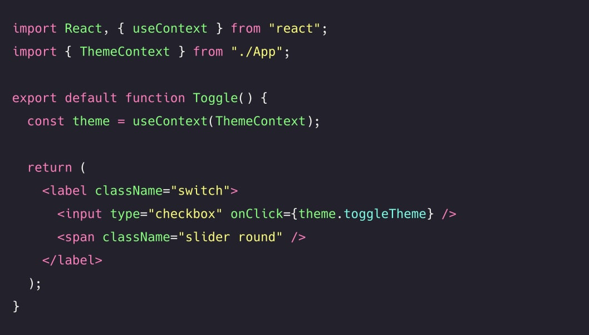
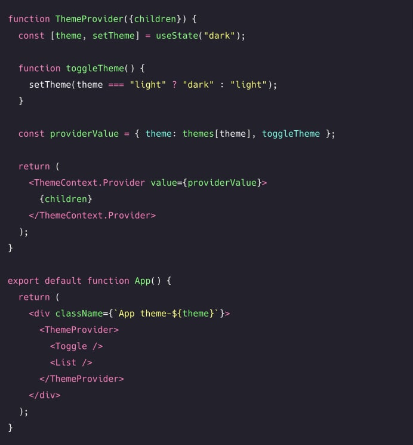

# **_Provider Pattern_**

> Make data available to multiple child components

In some cases, we want to make available data to many (if not all)
components in an application. Although we can pass data to components
using props, this can be difficult to do if almost all components in your
application need access to the value of the props.

We often end up with something called <b>prop drilling</b>, which is the case when
we pass props far down the component tree. Refactoring the code that relies
on the props becomes almost impossible, and knowing where certain data
comes from is difficult.

Let's say that we have one App component that contains certain data. Far
down the component tree, we have a ListItem, Header and
Text component that all need this data. In order to get this data to these
components, we'd have to pass it through multiple layers of components.

In our codebase, that would look something like the following:

    

Passing props down this way can get quite messy. If we want to rename
the data prop in the future, we'd have to rename it in all components. The
bigger your application gets, the trickier `prop drilling` can be.

It would be optimal of we could skip all the layers of components that don't
need to use this data. We need to have something that gives the components
that need access to the value of data direct access to it, without relying on
`prop drilling`

<b>This is where the Provider Pattern can help us out!</b>

With the Provider Pattern,
we can make data available to multiple components. Rather than passing that
data down each layer through props, we can wrap all components in
a `Provider`. A `Provider` is a higher order component provided to us by the
a `Context` object. We can create a `Context` object, using
the `createContext` method that React provides for us.

The `Provider` receives a `value` prop, which contains the data that we want to
pass down. All components that are wrapped within this provider have access
to the value of the value prop.

    

We no longer have to manually pass down the data prop to each component!

Each component can get access to the data, by using the useContext hook.
This hook receives the context that data has a reference with, DataContext
in this case. The useContext hook lets us read and write data to the context
object.

    

The components that aren't using the data value won't have to deal
with data at all. We no longer have to worry about passing props down several
levels through components that don't need the value of the props, which
makes refactoring a lot easier

    

The Provider pattern is very useful for sharing global data. A common use
case for the provider pattern is sharing a theme UI state with many
components.

Say we have a simple app that shows a list.

    

    

We want the user to be able to switch between light mode and dark mode, by
toggling the switch. When the user switches from dark to light mode and vice
versa, the background color and text color should change! Instead of passing
the current theme value down to each component, we can wrap the
components in a `ThemeProvider`, and pass the current theme colors to the
provider.

    

Since the Toggle and `List` components are both wrapped within
the ThemeContext provider, we have access to the
values theme and toggleTheme that are passed as a value to the provider.

Within the Toggle component, we can use the toggleTheme function to
update the theme accordingly.

    

The `List` component itself doesn't care about the current value of the theme.
However, the `ListItem` components do! We can use the theme context
directly within the `ListItem`.

    

Perfect! We didn't have to pass down any data to components that didn't care 
about the current value of the theme.

## Hooks 

We can create a hook to provide context to components. Instead of having to 
import `useContext` and the `Context` in each component, we can use a
hook that returns the context we need.

    

To make sure that it's a valid `theme`, let's throw an error
if `useContext(ThemeContext)` returns a falsy value. 

    

Instead of wrapping the components directly with 
the `ThemeContext.Provider` component, we can create a `HOC` that wraps 
this component to provide its values. This way, we can separate the context 
logic from the rendering components, which improves the reusability of the 
provider.

    

Each component that needs to have access to the ThemeContext, can now 
simply use the `useThemeContext` hook.

    

[View CodeSandBox](https://codesandbox.io/embed/quirky-sun-9djpl)