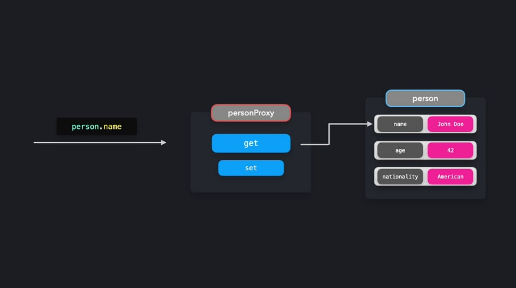
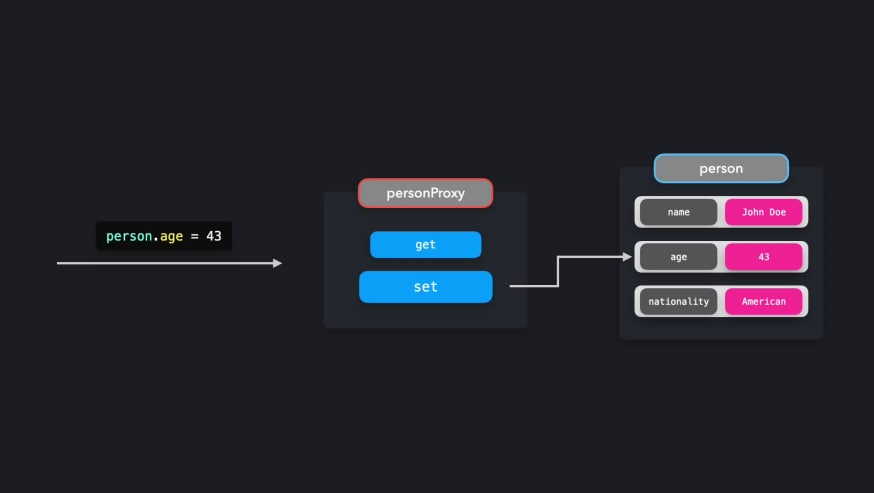
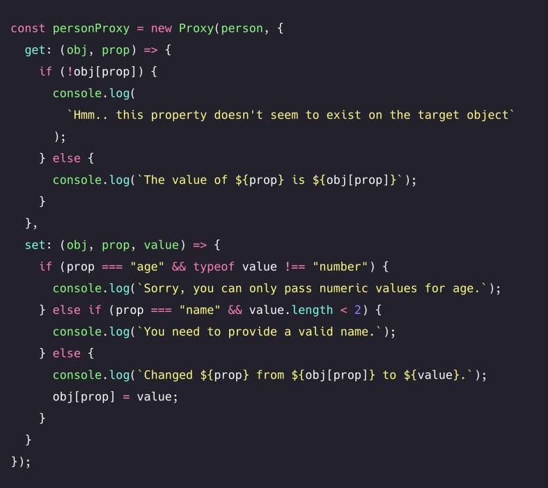

# **_proxy-pattern_**

> Share a single global instance throughout our application

With a <b>Proxy</b> object, we get more control over the interactions with certain
objects. A proxy object can determine the behavior whenever we're interacting
with the object, for example when we're getting a value, or setting a value.
Generally speaking, a proxy means a stand-in for someone else. Instead of
speaking to that person directly, you'll speak to the proxy person who will
represent the person you were trying to reach. The same happens in
JavaScript: instead of interacting with the target object directly, we'll interact
with the `Proxy` object.

let's create a person object that represents John Doe.

```ts
const person = {
  name: "John Doe",
  age: 42,
  nationality: "American",
};
```

Instead of interacting with this object directly, we want to interact with a proxy
object. In JavaScript, we can easily create a new proxy with by creating a new instance of Proxy.

```ts
const person = {
  name: "John Doe",
  age: 42,
  nationality: "American",
};

const personProxy = new Proxy(person, {});
```

The second argument of `Proxy` is an object that represents the handler. In the handler object, we can define specific behavior based on the type of interaction. Although there are many methods that you can add to the `Proxy`
handler, the two most common ones are `get` and `set`:

- `get`: Gets invoked when trying to access a property
- `set`: Gets invoked when trying to modify a property

Effectively, what will end up happening is the following:

<center>
    
</center>

<center>
    
</center>

Instead of interacting with the `person` object directly, we'll be interacting with
the `personProxy`.

Let's add handlers to the personProxy. When trying to modify a property,
thus invoking the set method on the proxy, we want it to log the previous value
and the new value of the property. When trying to access a property, thus
invoking the get a method on the Proxy, we want it to log a more readable
sentence that contains the key any value of the property.

```ts
const person = {
  name: "John Doe",
  age: 42,
  nationality: "American",
};

type TPerson = typeof person;

const personProxy = new Proxy(person, {
  get: (obj: TPerson, prop: keyof TPerson) => {
    console.log(`The value of ${prop} is ${obj[prop]}`);
  },
  set: (obj: TPerson, prop: keyof TPerson, value: never) => {
    console.log(`Changed ${prop} from ${obj[prop]} to ${value}`);
    obj[prop] = value;
    return true;
  },
});

personProxy.name; // The value of name is John Doe
personProxy.age = 43; // Changed age from 42 to 43
```

A proxy can be useful to add <b>validation</b>. A user shouldn't be able to
change person's age to a string value, or give him an empty name. Or if the
user is trying to access a property on the object that doesn't exist, we should
let the user know.

<center>
    
</center>

## Reflect

JavaScript provides a built-in object called `Reflect`, which makes it easier
for us to manipulate the target object when working with proxies.

Previously, we tried to modify and access properties on the target object within
the proxy through directly getting or setting the values with bracket notation.
Instead, we can use the `Reflect` object. The methods on
the `Reflect` object have the same name as the methods on
the handler object.
Instead of accessing properties through `obj[prop]` or setting properties
through `obj[prop] = value`, we can access or modify properties on the
target object through `Reflect.get()` and `Reflect.set()`. The methods
receive the same arguments as the methods on the handler object.

```ts
const person = {
  name: "John Doe",
  age: 42,
  nationality: "American",
};

type TPerson = typeof person;
type Keys = keyof typeof person;
type Values = TPerson[Keys];

const personProxy = new Proxy(person, {
  get: (obj: TPerson, prop: keyof TPerson) => {
    console.log(`The value of ${prop} is ${obj[prop]}`);
  },
  set: (obj: TPerson, prop: keyof TPerson, value: Values) => {
    console.log(`Changed ${prop} from ${obj[prop]} to ${value}`);
    return Reflect.set(obj, prop, value);
  },
});

personProxy.name; // The value of name is John Doe
personProxy.age = 43; // Changed age from 42 to 43
personProxy.name = "Jane Doe"; // Changed name from John Doe to Jane Doe
```

Proxies are a powerful way to add control over the behavior of an object. A 
proxy can have various use-cases: it can help with validation, formatting, 
notifications, or debugging.


Overusing the Proxy object or performing heavy operations on 
each handler method invocation can easily affect the performance of your 
application negatively. It's best to not use proxies for performance-critical 
code.