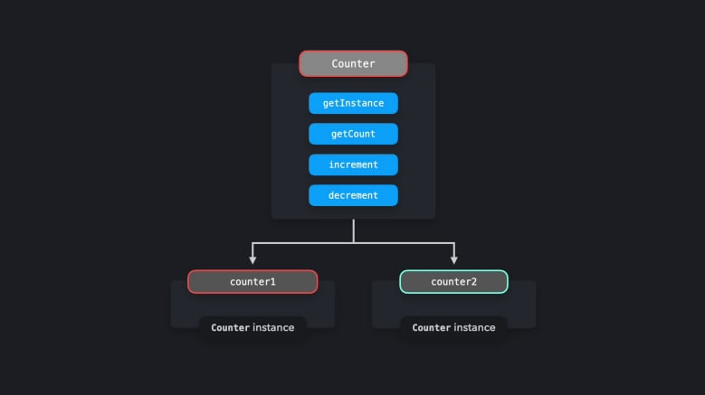
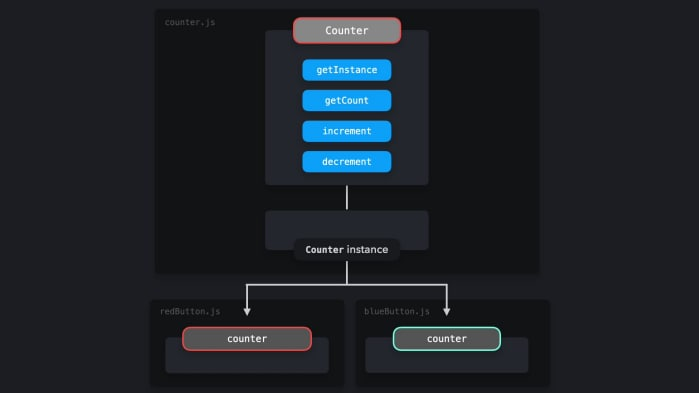
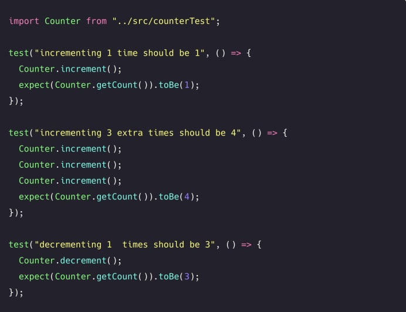
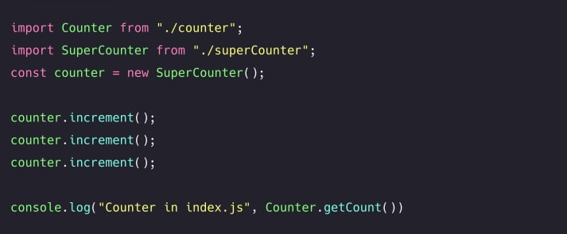

# **_Singleton Pattern_**

> Share a single global instance throughout our application

```ts
let counter: number = 0;

interface ICounter {
  getInstance(): Counter;
  getCount(): number;
  increment(): number;
  decrement(): number;
}

class Counter implements ICounter {
  /**
   *
   * @returns the value of the instance
   */
  getInstance(): Counter {
    return this;
  }

  /**
   *
   * @returns the current value of the counter
   */
  getCount(): number {
    return counter;
  }

  /**
   * @description increments the value of the counter
   * @returns the incremented value of the counter by one
   */
  increment(): number {
    return ++counter;
  }

  /**
   * @description decrements the value of the counter
   * @returns the decremented value of the counter by one
   */
  decrement(): number {
    return --counter;
  }
}

const counter1 = new Counter();
const counter2 = new Counter();

console.log(counter1.getInstance() === counter2.getInstance()); // false
```

as you see the code above, we are trying to create a class named `Counter` and at the moment we are able to create as much as instances that we need.

<center>
    
</center>

but the point of `Singleton Pattern` is to avoid creating more than one instances of our global class.

```ts
...
let instance: Counter;

class Counter implements ICounter {
  constructor() {
    if (instance) {
      throw new Error("you can only create one instance!");
    }
    instance = this;
  }
  ...
}

const counter1 = new Counter();
const counter2 = new Counter();
// Error: you can only create one instance
```

but if we export it like this

```ts
...
const signletonCounter = Object.freeze(new Counter());

export default signletonCounter
```

we can use it just as it needed to be used.

<center>
    
</center>

> you can see our full running example in [example](./example/) directory!

<hr>

## _(Dis)advantages_
Restricting the instantiation to just one instance could potentially save a lot of 
memory space. Instead of having to set up memory for a new instance each 
time, we only have to set up memory for that one instance, which is 
referenced throughout the application. However, Singletons are actually 
considered an anti-pattern, and can (or.. should) be avoided in JavaScript.

### Testing
Since we can't create 
new instances each time, all tests rely on the modification to the global 
instance of the previous test. The order of the tests matter in this case, and 
one small modification can lead to an entire test suite failing. After testing, we 
need to reset the entire instance in order to reset the modifications made by
the tests.
<center>
    
</center>

### Dependency hiding 
When importing another module, superCounter.js in this case, it may not be 
obvious that that module is importing a Singleton. In other files, such 
as index.js in this case, we may be importing that module and invoke its 
methods. This way, we accidentally modify the values in the Singleton. This 
can lead to unexpected behavior, since multiple instances of the Singleton can 
be shared throughout the application, which would all get modified as well.
<center>
    
</center>

### Global behavior 
A Singleton instance should be able to get referenced throughout the entire 
app. Global variables essentially show the same behavior: since global 
variables are available on the global scope, we can access those variables 
throughout the application.
index.js
Having global variables is generally considered as a bad design decision. 
Global scope pollution can end up in accidentally overwriting the value of a 
global variable, which can lead to a lot of unexpected behavior.

### State management in React
In React, we often rely on a global state through state management tools such 
as Redux or React Context instead of using Singletons. Although their global 
state behavior might seem similar to that of a Singleton, these tools provide 
a read-only state rather than the mutable state of the Singleton. When using 
Redux, only pure function reducers can update the state, after a component 
has sent an action through a dispatcher.